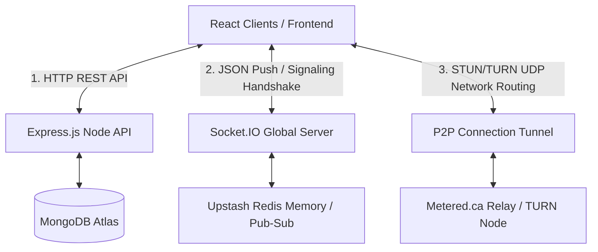

# 📁 Cấu Trúc Hệ Thống - ChatHub Real-Time Chat

## 🏗️ Tổng Quan Kiến Trúc

ChatHub là một ứng dụng giao tiếp thời gian thực hiện đại, kết hợp **MERN Stack** (MongoDB, Express.js, React, Node.js) để xử lý dữ liệu truyền thống, **Socket.io + Redis** cho Real-time Signaling & Multi-instance Scaling, và **WebRTC** cho tính năng Gọi Thoại/Video ngang hàng (P2P).

```
real-time-chat/
├── 📂 backend/           # Server-side (Node.js, Express, Socket.io, Mongoose, Redis, Cron)
├── 📂 frontend/          # Client-side (React, Vite, Tailwind CSS, WebRTC, Zustand)
├── 📄 package.json       # Root package configuration
├── 📄 README.md          # Tài liệu dự án
├── 📄 LICENSE            # Giấy phép MIT
└── 📂 docs/              # Tài liệu kiến trúc và hướng dẫn phát triển
```

---

## 🔧 Backend Structure (Node.js + Express)

```
backend/
├── 📂 src/
│   ├── 📂 controllers/           # Business Logic Layer
│   │   ├── 📄 auth.controller.js     # Xử lý authentication (login, signup, logout, up ảnh)
│   │   ├── 📄 message.controller.js  # Xử lý tin nhắn (send, get messages, get users sidebar)
│   │   └── 📄 call.controller.js     # Lịch sử cuộc gọi, Fetch cấu hình ICE Servers (Metered/STUN)
│   │
│   ├── 📂 lib/                   # Utility Libraries & Khởi tạo Hạ tầng Cluster
│   │   ├── 📄 cloudinary.js          # Cấu hình Cloudinary cho upload ảnh avatar/messages
│   │   ├── 📄 db.js                  # Kết nối MongoDB (Mongoose ODM)
│   │   ├── 📄 socket.js              # Socket.io Server Setup & @socket.io/redis-adapter
│   │   ├── 📄 call.socket.js         # WebRTC Signaling Backend (Initiate, Offer, Answer, ICE)
│   │   ├── 📄 redis.js               # Khởi tạo Upstash Redis cho Rate-Limiting & Caching
│   │   ├── 📄 cron.js                # Tác vụ Node-Cron dọn dẹp (Ghost Call) & Ping chống Sleep
│   │   ├── 📄 firebase.js            # Khởi tạo Firebase Admin SDK (Cấu hình Push Notification)
│   │   └── 📄 utils.js               # Tiện ích chung (Tạo JWT Token...)
│   │
│   ├── 📂 middleware/            # Middleware Layer
│   │   └── 📄 auth.middleware.js     # Chặn các Request chưa có Cookie JWT hợp lệ
│   │
│   ├── 📂 models/                # Data Models (Mongoose Schema)
│   │   ├── 📄 user.model.js          # Lược đồ người dùng (Mật khẩu hash, Profile Pic)
│   │   ├── 📄 message.model.js       # Lược đồ tin nhắn (Văn bản, Hình ảnh, Người gửi/nhận)
│   │   └── 📄 callLog.model.js       # Nhật ký Cuộc gọi (Logs trạng thái Calling, Thời lượng)
│   │
│   ├── 📂 routes/                # Cấu hình API endpoints (Express Router)
│   │   ├── 📄 auth.route.js          # /api/auth/*
│   │   ├── 📄 message.route.js       # /api/messages/*
│   │   └── 📄 call.route.js          # /api/calls/*
│   │
│   ├── 📂 seeds/                 # Dữ liệu Khởi tạo (Database Seeding)
│   │   └── 📄 user.seed.js           # Dữ liệu mẫu (Dummy data) cho môi trường dev
│   │
│   └── 📄 index.js               # Entry point (App Setup, API Routing, Health Check endpoint)
│
├── 📄 package.json               # Dependencies backend
└── 📄 package-lock.json          
```

### 🔑 Backend Key Features:
- **Xử lý Thời gian thực Toàn diện:** Sử dụng cơ chế Pub/Sub qua `@socket.io/redis-adapter` song song với WebRTC Signaling tốc độ cao.
- **RESTful + Realtime:** Giao thức kết hợp lấy lịch sử chat bằng hàm Fetch và Emit Chat ngay lập tức qua WebSocket.
- **Bảo mật Đa lớp:** Quản trị đăng nhập bằng JWT HTTP-only Cookies, xác thực mật khẩu qua bcrypt, chống phá hoại API qua Redis Rate-Limit.
- **Micro-tasks Tự Động:** Quản lý vòng đời rác thải với Cron-Job và chống Server Render Free-Tier bị ngắt điện.

---

## 🎨 Frontend Structure (React + Vite)

```
frontend/
├── 📂 public/                    # Static Assets (Truy cập công khai)
│   ├── 📄 avatar.png                 # Default avatar 
│   ├── 📄 chat-hub-logo-2.png        # Logo của ứng dụng
│   └── 📄 vite.svg                   # Vite icon
│
├── 📂 src/
│   ├── 📂 components/            # UI Components & Micro-Views
│   │   ├── 📂 skeletons/             # Loading Skeletons (UI hiệu ứng khung xương tải tĩnh)
│   │   │   ├── 📄 MessageSkeleton.jsx    
│   │   │   └── 📄 SidebarSkeleton.jsx    
│   │   │
│   │   ├── 📄 AuthImagePattern.jsx   # Khung giao diện Decorator màn hình Login/Register
│   │   ├── 📄 Avatar.jsx             # Component ảnh đại diện chung xử lý lỗi URL ảnh ngỏm
│   │   ├── 📄 ChatContainer.jsx      # Wrapper chính cuộn tin nhắn
│   │   ├── 📄 ChatHeader.jsx         # Hiển thị Tên User & Trạng thái Online
│   │   ├── 📄 MessageInput.jsx       # Thanh Chat gõ phím & Button Upload đính kèm ảnh
│   │   ├── 📄 Sidebar.jsx            # Cột danh sách User & Khung tìm kiếm/Lọc người online
│   │   ├── 📄 Navbar.jsx             # Menu định hướng cấp cao (Profile, Theme, Đăng xuất)
│   │   ├── 📄 NoChatSelected.jsx     # Màn hình Splash khi chưa bấm vào ai
│   │   ├── 📄 CallHistory.jsx        # Lịch sử / Thông số các Cuộc Gọi (WebRTC)
│   │   ├── 📄 DeviceLobby.jsx        # Màn hình xin/kiểm tra cấp quyền Camera & Mic trước khi Gọi
│   │   └── 📄 CallOverlay.jsx        # PiP Gọi điện trôi nổi (Có Nút Tắt Mic/Hình, Audio nền ẩn)
│   │
│   ├── 📂 lib/                   # Utility & API configuration
│   │   ├── 📄 axios.js               # Instance config có gắn BaseURL & Credentials
│   │   ├── 📄 webrtc.js              # Native RTC Setup (Cleanup Connection, IceConfig)
│   │   └── 📄 firebase.js            # Cấu hình Token Firebase Client cho Push Notification OS
│   │
│   ├── 📂 pages/                 # Full Page Components (React Router)
│   │   ├── 📄 HomePage.jsx           # Trang điều phối giao tiếp chính (Chat + Call Overlay)
│   │   ├── 📄 LoginPage.jsx          # Cổng đăng nhập
│   │   ├── 📄 SignUpPage.jsx         # Cổng đăng ký tài khoản mới
│   │   ├── 📄 ProfilePage.jsx        # Nơi xem thẻ thông tin và đổi Avatar (Cloudinary Uploading)
│   │   └── 📄 SettingsPage.jsx       # Quản lý 32+ Màu sắc Theme theo DaisyUI
│   │
│   ├── 📂 store/                 # State Management System (Zustand Global Hooks)
│   │   ├── 📄 useAuthStore.js        # Auth, Socket Global Init, Lắng nghe Trạng thái Offline
│   │   ├── 📄 useChatStore.js        # Fetch History, Lắng nghe tin mới (`subscribeToMessages`)
│   │   ├── 📄 useCallStore.js        # Xử lý Máy trạng thái WebRTC (Calling -> Ringing -> Connected)
│   │   └── 📄 useThemeStore.js       # Giữ thông tin Theme (Persist localStorage)
│   │
│   ├── 📄 App.jsx                # Root Node chứa Routing logic, Toaster và Loader
│   ├── 📄 main.jsx               # Entry Point gắn React DOM Rendering Context
│   └── 📄 index.css              # Reset Styles & Khai báo Tailwind Base Config
│
├── 📄 package.json               # Các plugins và Scripts Build UI
├── 📄 tailwind.config.js         # Theme DaisyUI Setup & Tailwind Plugins Configuration
└── 📄 vite.config.js             # Dev Tools (HMR) & Alias Path Builder
```

### 🎯 Frontend Key Features:
- **Tách Biệt Model - View (Zustand):** Hệ thống không dùng Context API để chống re-render vô ích, State nghiệp vụ Call/Message được xử lý hoàn toàn qua Zustand.
- **Trải Nghiệm Media Thượng Thừa:** Xử lý luồng Media Stream native từ phần cứng Camera thông qua `navigator.mediaDevices`, chống lặp vòng lặp Component Mount.
- **Giao Thức Tách Hình - Tách Mute (Per-Media Signals):** WebRTC tích hợp xử lý Track Lifecycle song song Socket.IO giúp hệ thống phát hiện chính xác người dùng tắt hình không độ trễ.
- **Themes Rực Rỡ:** Setup 32 Theme Dark/Light từ base Daisy UI tích hợp Tailwind v3.

---

## 🔄 Kiến Trúc Luồng Dữ Liệu (Data Flow)

ChatHub áp dụng mô hình 3 trục chính: Truyền dữ liệu RESTful, Broadcast Real-time (Socket), và Streaming P2P (WebRTC).



* **Trục 1 (RESTful - Auth/Chat History):** Chạy JWT Cookies Stateless, thao tác dữ liệu text json. 
* **Trục 2 (Socket + Redis Bus):** Dispatch sự kiện thời gian siêu ngắn, định tuyến user theo Session ID ngay lập tức.
* **Trục 3 (WebRTC Raw Bytes):** Truyền trực tiếp Byte Hình ảnh/Âm thanh giữa 2 thiết bị mà Server ChatHub không đi vào giữa, phân hóa giảm chi phí Traffic Server về 0$.

---

## 🚀 Deployment Structure

### Development Mode (Môi trường Dev):
- **Frontend Vite HMR:** Chạy cấp tốc trên `http://localhost:5173`.
- **Backend Node.js:** Chạy API và Cổng WebSocket song song trên `http://localhost:5001`.

### Production Mode (Môi trường Đóng Gói Thực Tế):
- **Kiến trúc Server Monolithic Scale:** React Source được Build ra HTML/CSS nén (Dist), và cấp Serve thẳng thông qua 1 Lỗ cổng Express Controller trên nền tảng Render.com
- **Khối Ngoại Chức (External Services Dependency):** Cơ sở Hạ tầng đan chéo lên MongoDB Atlas (Data), Upstash Redis Cloud (Caching Scale), Metered API (Relay UDP Voice Media), Cloudinary.JS (Binary CDN Cloud).

---

*Cấu trúc này là bản cải tiến diện rộng vào tháng 03/2026. Lấy lõi là MERN Stack, bù đắp yếu điểm bằng mô hình Multi-Instance Micro-Memory, đem đến sự linh hoạt tuyệt đối cho người dùng mở rộng sau này.*